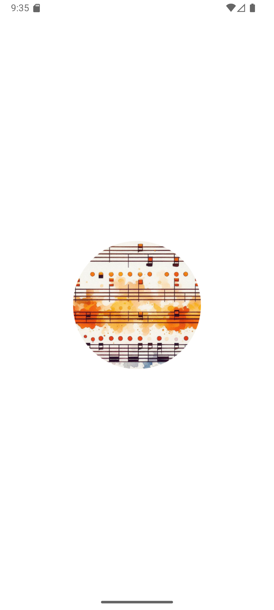
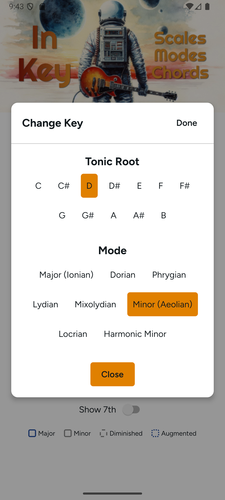
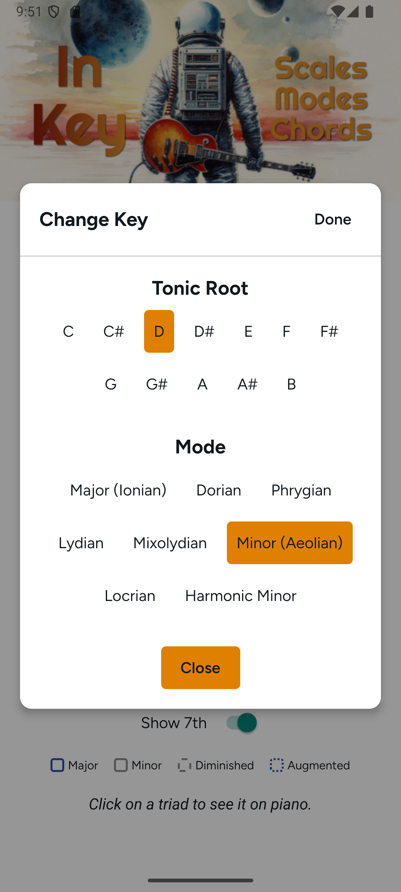
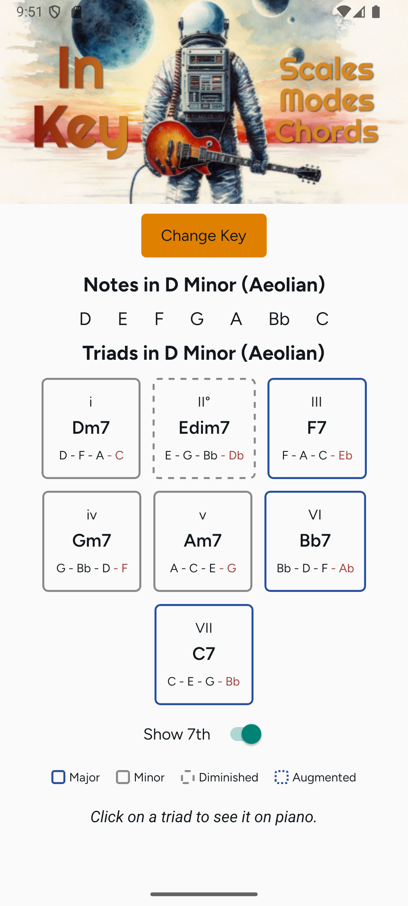

# In Key - Chords and Modes

  

In Key is a React Native (Expo) app that determines the diatonic notes and chords in a chosen key and mode. Select any root note and one of eight modes to instantly see the notes of the scale, the triads built on each scale degree, and an on-screen piano keyboard showing exactly which keys are in the chord.

The scales are determined programmatically, using the major scale intervals as a base and adjusting by scale degrees for the chosen mode.

## Features

- **Root note selector** - pick any of the 12 chromatic roots (C through B).
- **Eight modes** - Major (Ionian), Dorian, Phrygian, Lydian, Mixolydian, Minor (Aeolian), Locrian, and Harmonic Minor.
- **Scale notes** - the correctly spelled notes of the scale for the chosen key, using sharps or flats as appropriate.
- **Triads per degree** - the chord built on every scale degree, labeled with Roman numerals (e.g. I, ii, iii, IV, V, vi, vii°) and color-coded by quality: major, minor, diminished, and augmented.
- **Seventh chords** - toggle "Show 7th" to display dominant seventh chords for each degree.
- **Piano view** - tap any triad to see it rendered on a piano keyboard, with the chord tones highlighted and labeled.

  

## Screenshots

  
  
  

